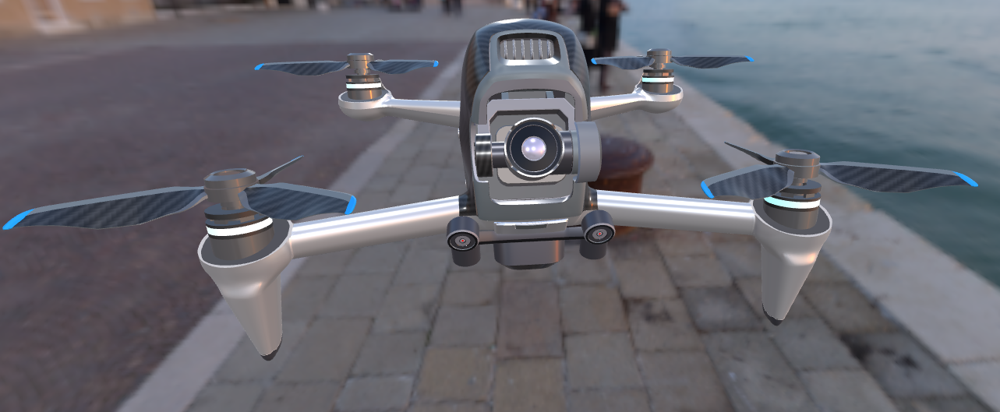

# 3D-Drone-Threejs

This project is a 3D web application that showcases an interactive 3D model of a drone using Three.js.

## Features

-   **Interactive 3D Model:** Explore a detailed 3D drone model.
-   **Orbit Controls:** Rotate, pan, and zoom the camera to view the drone from different angles.
-   **Realistic Lighting:** The scene is illuminated with ambient and directional lights, enhancing the visual fidelity.
-   **Environment Mapping:** An HDR image is used for background and environment reflections, providing a more immersive experience.
-   **Responsive Design:** The application adapts to different screen sizes.

## How to Run Locally

To run this project on your local machine, simply open the `index.html` file in your web browser.

Alternatively, you can use a simple Python web server:

1.  Navigate to the project directory in your terminal.
2.  Run the following command:

    ```bash
    python -m http.server
    ```

3.  Open your web browser and go to `http://localhost:8000`.

## Deployment

This project can be easily deployed to static hosting services like Vercel. Simply connect your Git repository or upload the project files, and Vercel will handle the deployment.

## Screenshots

Here are some screenshots of the 3D drone in action:

